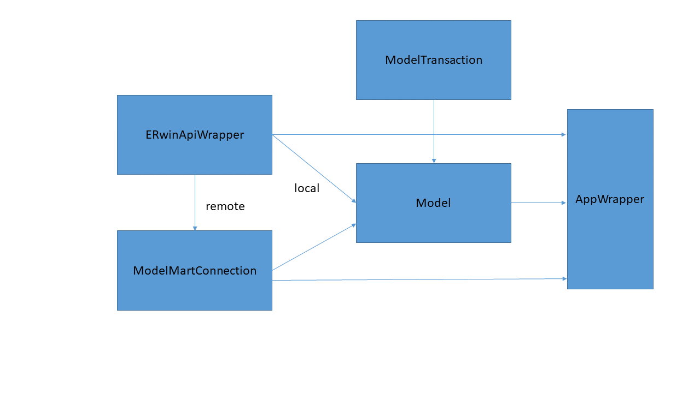

# ERwin API Wrapper

A .NET Framework library that provides a simple set of classes to manipulate local and remote ERwin Data Modeler data models.

**Note:** *not affiliated with or endorsed by ERwin Data Modeler*

## Getting Started

The code simply needs to be added as a dependency of whatever application needs to use the code. The ERwin client must be installed and running with a valid license.

   1. Clone this repo
   1. **Important** Open ERwin Data Modeler before trying to use the ERwin API.
   1. **Also Important** Change the target architecture to match your ERwin installation (either x64 or x86). 
      1. `System.Runtime.InteropServices.COMException : Retrieving the COM class factory for component with CLSID {6774E2C3-06E9-4943-A8D4-E3007AB1F42E} failed due to the following error: 80040154 Class not registered (Exception from HRESULT: 0x80040154 (REGDB_E_CLASSNOTREG))`
   1. Open the *.sln in Visual Studio
   1. Ensure you have a COM reference to erwin Script Client API Library (EAL.dll). The default location is `C:\Program Files\erwin\Data Modeler r9\EAL.dll`

### Usage Example

The following sample code exemplifies basic local model usage.

    try
    {
        //open existing model
        ERwinApiWrapper app = new ERwinApiWrapper();
        Model m = app.OpenModel("model.erwin");
        var tables = m.GetTables();
        m.Close();

        //create new model
        Model m2 = app.AddNewModel("newmodel.erwin");
        //write to file system
        m2.Save();

        var trans = m.BeginTransaction();

        Table t = m2.AddNewTable();
        t.LogicalName = "MyNewTable";
        t.LogicalDefinition = "my logical def";

        Column c = t.AddNewColumn();
        c.LogicalName = "My Col";
        c.LogicalDatatype = "Char(123)";
        c.LogicalDefinition = "my deifnition";

        trans.Commit();

        m2.Save();
        m2.Close();
    }
    catch (Exception ex)
    {
        System.Console.WriteLine(ex.Message);
    }

The following sample code exemplifies basic remote model usage.

    try
    {
        ModelMartConfiguration configuration = new ModelMartConfiguration("server", "username", "password");
        ERwinApiWrapper app = new ERwinApiWrapper(configuration);
        app.ModelMartConnection.Open();
        var martIsOpen = app.ModelMartConnection.IsConnected;
        if (martIsOpen)
        {
            Model m = app.ModelMartConnection.OpenModel("MART://MART/DIRECTORY/MODELNAME");
            int entityCount = m.GetTableCount();
            app.ModelMartConnection.SaveMMModelToLocal(m, "test.erwin");
            app.ModelMartConnection.Close();
        }
    }
    catch (Exception ex)
    {
        System.Console.WriteLine(ex.Message);
    }

## Architecture

### Classes

#### ERwinApiWrapper

The ERwinApiWrapper class is the starting point for all local and remote operations. Local operations are performed via the OpenModel() or AddNewModel() methods and remote operations are performed via the OpenModel() and SaveMMModelToLocal() methods on the ERwinApiWrapper's ModelMartConnection property.

#### ModelMartConnection

To use a ModelMartConnection, it must be provided a ModelMartConfiguration and the Open() method must be called. After the connection is open, then methods such as OpenModel() can be called. Finally, Close() must be called to close the connection.

#### Model

A Model class encapsulates the SCAPI objects associated with an ERwin model. Models can be manipulated using methods or by accessing the SCAPI objects directly.

When finished, the Close() method must be called for local models, but not for remote models. Closing a ModelMartConnection will also close a remote model.

#### ModelTransaction

A ModelTransaction class can be used to group multiple operations together, so they all either succeed or fail. Transactions are completed by calling either Commit() or Rollback().

#### AppWrapper

An AppWrapper is used to pass a SCAPI Application object between the various classes while eliminating the need for users of the  ERwinApiWrapper library to add a reference to the SCAPI COMlibrary.

## Maintainers

This project is maintained by the Data Administration and Data Quality Branch at SSA.
